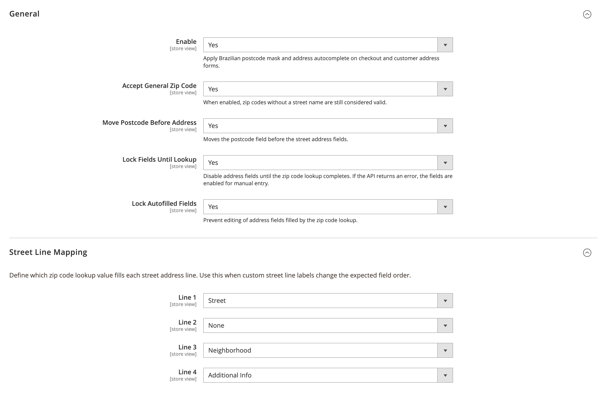
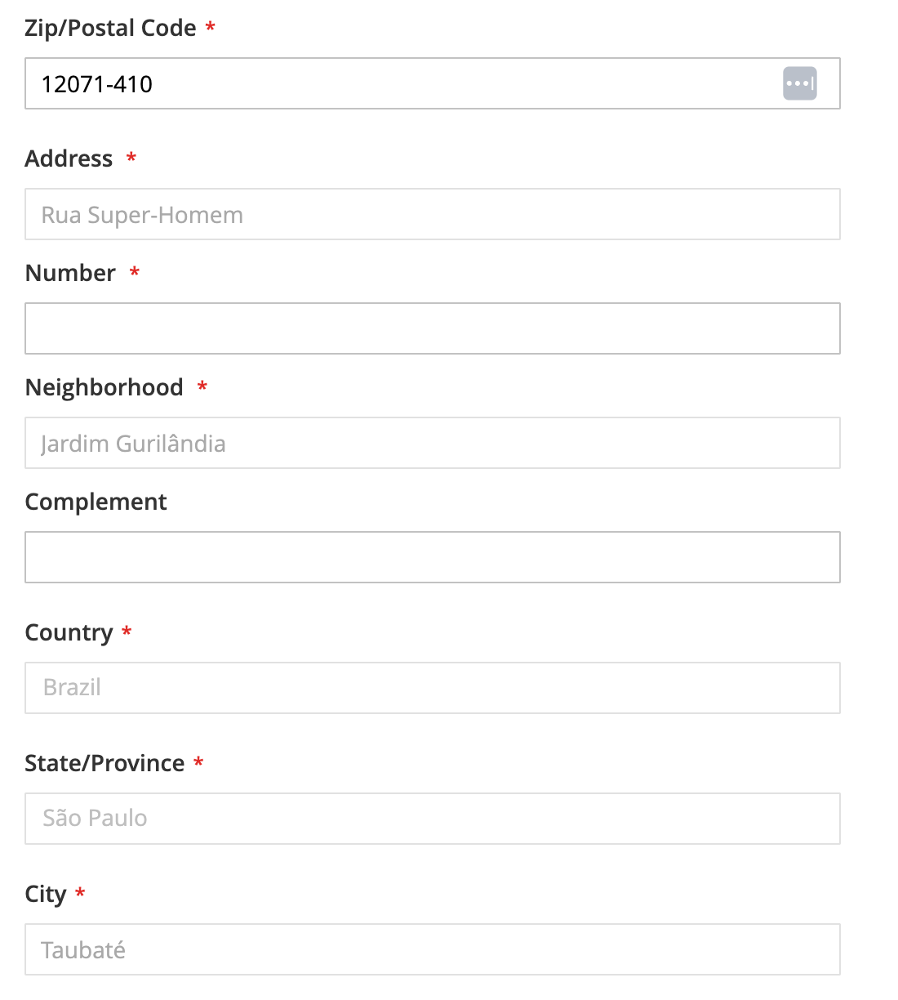

# System Code Address Autocomplete (Brazil)

## About Module

Adds Brazilian CEP masking and address autocomplete on checkout and customer address forms. Looks up street, neighborhood, city, and state via zip code API, with options to reorder fields, disable address fields until lookup completes, lock autofilled data (including street prefix), and allow manual entry on lookup failure.

### Configuration

**Stores > Configuration > System Code > Address Autocomplete (Brazil)**

### Screenshots

#### Admin Configuration


#### Frontend


### Requirements

- `systemcode/base`
- `systemcode/customer`
- `magento/module-customer`
- `magento/module-checkout`
- `magento/module-directory`

### How to install

#### ✓ Install by Composer (recommended)
```
composer require systemcode/base systemcode/customer systemcode/customer-address-autocomplete-brazil
php bin/magento module:enable SystemCode_CustomerAddressAutocompleteBrazil
php bin/magento setup:upgrade
```

#### ✓ Install Manually
- Copy module to folder `app/code/SystemCode/CustomerAddressAutocompleteBrazil` and run commands:
```
php bin/magento module:enable SystemCode_CustomerAddressAutocompleteBrazil
php bin/magento setup:di:compile
php bin/magento setup:upgrade
```

### Suggested installation bundles

These modules are not required by Address Autocomplete (Brazil), but work well together for a complete Brazilian address experience.

#### Address essentials
Custom street labels, street prefix, and CEP autocomplete.
```
composer require systemcode/base systemcode/customer \
  systemcode/customer-street-lines \
  systemcode/customer-street-prefix \
  systemcode/customer-address-autocomplete-brazil
```

#### Address autocomplete + registration
Collect the customer address during account creation.
```
composer require systemcode/base systemcode/customer \
  systemcode/customer-address-autocomplete-brazil \
  systemcode/customer-address-registration
```

#### Address + Brazilian identity
Combine address autocomplete with CPF/CNPJ customer identity.
```
composer require systemcode/base systemcode/customer \
  systemcode/customer-address-autocomplete-brazil \
  systemcode/customer-identity-brazil
```

#### Full Brazilian storefront stack
Address, identity, registration, street labels, and street prefix.
```
composer require systemcode/base systemcode/customer \
  systemcode/customer-address-autocomplete-brazil \
  systemcode/customer-address-registration \
  systemcode/customer-street-lines \
  systemcode/customer-street-prefix \
  systemcode/customer-identity-brazil
```

#### Full stack with Enhanced identity
Dedicated CPF, CNPJ, Social Name, and Trade Name fields.
```
composer require systemcode/base systemcode/customer \
  systemcode/customer-address-autocomplete-brazil \
  systemcode/customer-address-registration \
  systemcode/customer-street-lines \
  systemcode/customer-street-prefix \
  systemcode/customer-identity-brazil \
  systemcode/customer-identity-brazil-enhanced
```

### License
OSL-3.0

### Authors
* [Eduardo Diogo Dias](https://github.com/eduardoddias)


---


## Sobre o Módulo

Adiciona máscara de CEP brasileiro e autocomplete de endereço no checkout e nos formulários de endereço do cliente. Consulta logradouro, bairro, cidade e estado pela API de CEP, com opções para reordenar campos, desabilitar endereço até a consulta, bloquear campos preenchidos automaticamente (incluindo prefixo de logradouro) e permitir preenchimento manual em caso de falha.

### Configuração

**Lojas > Configuração > System Code > Address Autocomplete (Brazil)**

### Screenshots

#### Configuração no Admin


#### Frontend


### Requisitos

- `systemcode/base`
- `systemcode/customer`
- `magento/module-customer`
- `magento/module-checkout`
- `magento/module-directory`

### Como Instalar

#### ✓ Instalação via Composer (recomendado)
```
composer require systemcode/base systemcode/customer systemcode/customer-address-autocomplete-brazil
php bin/magento module:enable SystemCode_CustomerAddressAutocompleteBrazil
php bin/magento setup:upgrade
```

#### ✓ Instalação Manual
- Copie o módulo para `app/code/SystemCode/CustomerAddressAutocompleteBrazil` e execute:
```
php bin/magento module:enable SystemCode_CustomerAddressAutocompleteBrazil
php bin/magento setup:di:compile
php bin/magento setup:upgrade
```

### Combinações de instalação sugeridas

Estes módulos não são obrigatórios para o Address Autocomplete (Brazil), mas combinam bem para uma experiência completa de endereço brasileiro.

#### Essenciais de endereço
Rótulos de rua, prefixo de logradouro e autocomplete de CEP.
```
composer require systemcode/base systemcode/customer \
  systemcode/customer-street-lines \
  systemcode/customer-street-prefix \
  systemcode/customer-address-autocomplete-brazil
```

#### Autocomplete + cadastro
Coleta o endereço do cliente já no cadastro.
```
composer require systemcode/base systemcode/customer \
  systemcode/customer-address-autocomplete-brazil \
  systemcode/customer-address-registration
```

#### Endereço + identidade brasileira
Autocomplete de endereço com identidade CPF/CNPJ.
```
composer require systemcode/base systemcode/customer \
  systemcode/customer-address-autocomplete-brazil \
  systemcode/customer-identity-brazil
```

#### Stack completo brasileiro
Endereço, identidade, cadastro, rótulos de rua e prefixo de logradouro.
```
composer require systemcode/base systemcode/customer \
  systemcode/customer-address-autocomplete-brazil \
  systemcode/customer-address-registration \
  systemcode/customer-street-lines \
  systemcode/customer-street-prefix \
  systemcode/customer-identity-brazil
```

#### Stack completo com identidade Enhanced
Campos dedicados de CPF, CNPJ, Razão Social e Nome Fantasia.
```
composer require systemcode/base systemcode/customer \
  systemcode/customer-address-autocomplete-brazil \
  systemcode/customer-address-registration \
  systemcode/customer-street-lines \
  systemcode/customer-street-prefix \
  systemcode/customer-identity-brazil \
  systemcode/customer-identity-brazil-enhanced
```

### Licença
OSL-3.0

### Autores
* [Eduardo Diogo Dias](https://github.com/eduardoddias)
